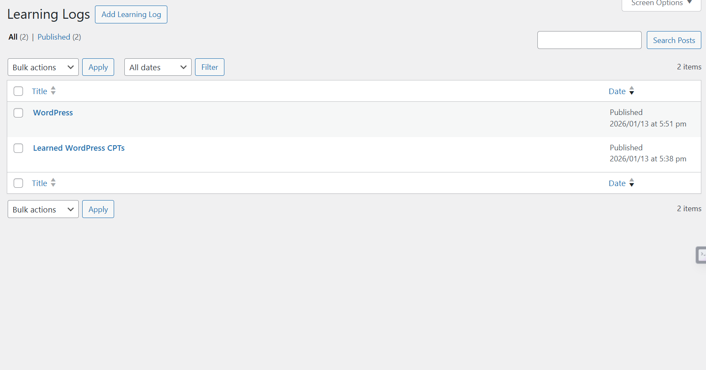

# LogIt

LogIt is a SaaS-style developer dashboard built using WordPress.

The goal of LogIt is to help developers:
- Track projects they are working on
- Log daily learning and work
- Visualize progress over time through a dashboard

This project is built incrementally to demonstrate real-world WordPress plugin development and clean Git practices.

# LogIt 🧠📊  
A personal developer activity & learning tracker built with WordPress.

LogIt helps developers track:
- Projects they are working on
- Active vs completed work
- Daily learning progress
- Recent development activity

Built as a **SaaS-style internal dashboard** using modern WordPress best practices.

---

## 🚀 Why LogIt?

Most developers:
- Work on multiple projects
- Learn new concepts daily
- Forget to track progress

LogIt solves this by providing a **single dashboard** to:
- Track projects
- Log learning
- Visualize activity

This project was built to demonstrate **real-world WordPress plugin engineering**.

---

## 🛠️ Tech Stack

- WordPress (Custom Plugin)
- PHP
- MySQL
- WordPress Admin APIs
- Custom Post Types
- WP_Query
- Admin Dashboard UI

---

## ✨ Features

### 📁 Projects
- Create and manage projects
- Project statuses: Active / Paused / Completed
- Active project count on dashboard

### 📘 Learning Logs
- Log daily learning entries
- Track learning volume over time

### 📊 Dashboard
- Total Projects
- Active Projects
- Learning Logs count
- Recent Activity feed with timestamps

---

## 🧩 Architecture

- Custom WordPress plugin (`logit`)
- Uses Custom Post Types for data modeling
- Dashboard built using WordPress admin APIs
- Clean, incremental development approach

---

## 📸 Screenshots

### Dashboard

### Projects

### Learning Logs

---

## 🔮 Roadmap

- Dark SaaS-style UI
- Calendar-based activity view
- User-specific dashboards
- REST API integration

---

## 👤 Author

**Sandeep Jakka**  
WordPress & Full-Stack AI Developer

---

## 📄 License

MIT
